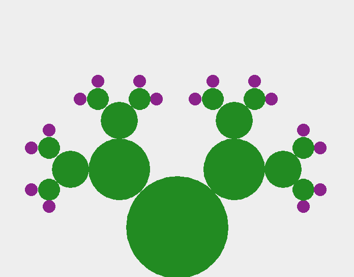

# Opuntia Fractal

## Description

The program provides functionality to draw an opuntia (prickly pear cactus) fractal. By default, the recursion depth is 5 and the children of the main fractal are 45% of the size of the parent, drawn at 45° from the parent's orientation. All the levels of the opuntia are green color RGB(34, 139, 34) but for the leaf children RGB(139, 34, 139). The GUI offers several options for user to adjust:
<ul>
  <li>recursion depth of the fractals (2 to 10)</li>
  <li>ratio of child's radius to parent's radius (40 to 70)</li>
  <li>degree of the position of the child to the parent (25 to 60)</li>
  <li>cactus and pear color chooser</li>
</ul>

It has been developed using MVC and Observer patterns with custom-implemented ArrayList based on the Stuart Reges' version of the class. Additional functionality was implemented to remove all nulls from an ArrayList:

```
public void compressNulls(){
        int elementPointer = 0; //start at the beginning of the array
        while (elementData[elementPointer] != null && elementPointer < this.size){
            elementPointer++;
            if (elementPointer >= this.size){
                return;
            }
        }
        // Once the first null value is found, start moving all non-null values to the position maintained by counter
        int currentNull = elementPointer;
        int counterNulls = 1;
        for (elementPointer++; elementPointer <= this.size; elementPointer++){
            if (elementData[elementPointer] != null){
                elementData[currentNull] = elementData[elementPointer];
                currentNull++;
            } else {
                counterNulls++;
            }
        }
        this.size = this.size - counterNulls+1;
    }
```


## GUI

Main menu


Opuntal Fractal drawn



## Requirements

<ul>
  <li>Java 11 or higher</li>
  <li>Java Swing</li>
</ul>

## Authors and acknowledgement

Base code for ArrayList by Stuart Reges

Iulia Bejsovec
